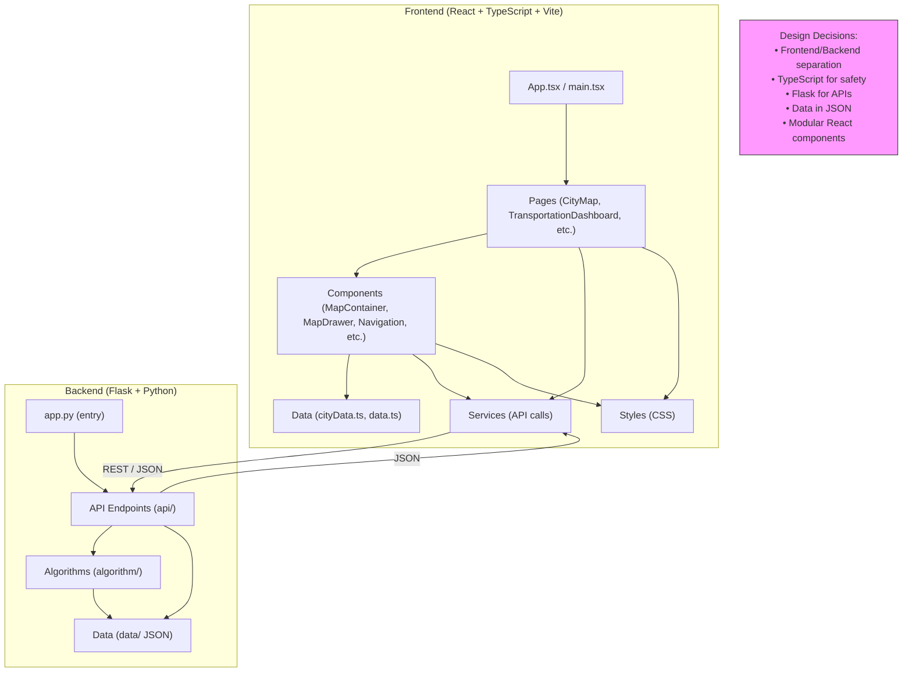

# Cairo Transportation Network Optimization Project Report

## System Architecture and Design Decisions




## Algorithm Implementations and Modifications

This section details the core algorithmic components implemented and customized for the pathfinding and infrastructure planning features of the project. The primary focus is on the A* and Dijkstra algorithms for route finding, as well as the Minimum Spanning Tree (MST) algorithm for network optimization. Each algorithm was adapted to suit the specific requirements of urban transportation networks, including the integration of real-world constraints such as traffic, road conditions, and critical infrastructure nodes.

---

### 1. Pathfinding Algorithms

#### A* Algorithm

**Implementation:**  
The A* algorithm is implemented in the `AStarAlgorithm` class. It is designed to find the shortest path between two nodes in a road network graph, using a heuristic based on geographic distance (the Haversine formula). This heuristic estimates the "as-the-crow-flies" distance between nodes, improving efficiency over Dijkstra in large, spatially-embedded networks.

**Key Features and Modifications:**
- **Geographic Heuristic:**  
  The heuristic function uses the latitude and longitude of nodes to compute the Haversine distance, providing an admissible and consistent estimate for real-world road networks.
- **Edge Weights:**  
  The algorithm considers edge weights such as distance, traffic, and road conditions, which are dynamically loaded from the dataset.
- **Integration with NetworkX:**  
  The implementation leverages NetworkX's extensibility, but customizes the heuristic and edge attribute handling for transportation-specific data.

**Relevant Code:**
````python
class AStarAlgorithm:
    @staticmethod
    def haversine(lon1, lat1, lon2, lat2):
        # ... Haversine formula implementation ...
    @staticmethod
    def find_route(G, origin, dest):
        def heuristic(u, v):
            ux, uy = G.nodes[u]["x"], G.nodes[u]["y"]
            gx, gy = G.nodes[v]["x"], G.nodes[v]["y"]
            return AStarAlgorithm.haversine(ux, uy, gx, gy)
        # ... A* search using heuristic ...
````

---

#### Dijkstra's Algorithm

**Implementation:**  
Dijkstra's algorithm is implemented in the `DijkstraAlgorithm` class. It computes the shortest path between two nodes based solely on edge weights, without a heuristic.

**Key Features and Modifications:**
- **Edge Attribute Handling:**  
  The algorithm is adapted to use transportation-specific edge attributes (e.g., distance, traffic, road type).
- **Fallback for Non-Spatial Data:**  
  Dijkstra is used as a baseline when heuristic information is unavailable or unnecessary.

**Relevant Code:**
````python
class DijkstraAlgorithm:
    @staticmethod
    def find_route(G, origin, dest):
        # ... Dijkstra's algorithm using edge weights ...
````

---

### 2. Minimum Spanning Tree (MST) Algorithms

#### Base MST Construction

**Implementation:**  
The `MSTAlgorithm` class provides methods for constructing a Minimum Spanning Tree from the transportation network graph. The base MST is built using NetworkX's `minimum_spanning_tree` function, with edge weights reflecting real-world distances or costs.

**Relevant Code:**
````python
@staticmethod
def build_base_mst(G: nx.Graph, weight_attr: str = "weight") -> nx.Graph:
    return nx.minimum_spanning_tree(G, weight=weight_attr)
````

---

#### Enhanced MST with Critical Nodes

**Modification:**  
A significant extension is the ability to ensure that certain "critical nodes" (e.g., hospitals, major hubs) are always included and well-connected in the MST. This is achieved by:

- **Weight Adjustment:**  
  Edge weights connected to critical nodes are reduced (by a configurable factor), increasing their likelihood of inclusion in the MST.
- **Post-Processing:**  
  After constructing the base MST, the algorithm checks for any critical nodes not connected and adds the shortest paths from the original graph to ensure full connectivity.

**Relevant Code:**
````python
@staticmethod
def adjust_weights_for_critical_nodes(G, critical_nodes, factor=0.1):
    for node in critical_nodes:
        for neighbor in G.neighbors(node):
            G.edges[node, neighbor]['weight'] *= factor
    return G

@staticmethod
def build_enhanced_mst(G, critical_nodes):
    G_adjusted = MSTAlgorithm.adjust_weights_for_critical_nodes(G, critical_nodes)
    base_mst = MSTAlgorithm.build_base_mst(G_adjusted)
    # ... Add missing critical nodes by shortest path ...
````

---

### 3. Integration and API Endpoints

The algorithms are exposed via Flask API endpoints (`flow_optimization_routes.py`), allowing frontend and external tools to request optimal routes using either A* or Dijkstra, and to retrieve MST-based infrastructure plans.

**Example Endpoints:**
- `/route/astar?origin=...&dest=...`
- `/route/dijkstra?origin=...&dest=...`

Each endpoint returns the path, total distance, and estimated travel time, calculated using the selected algorithm and real-time traffic data.

---

### 4. Summary of Modifications

- **Heuristic Customization:**  
  A* uses a geographic heuristic tailored for urban networks.
- **Critical Node Handling:**  
  MST construction is enhanced to prioritize and guarantee connectivity for critical infrastructure.
- **Traffic and Road Condition Awareness:**  
  Both pathfinding and MST algorithms consider dynamic attributes such as traffic volume, road type, and condition.
- **API Integration:**  
  Algorithms are modularized and exposed via RESTful endpoints for seamless frontend/backend interaction.

---

These algorithmic implementations and modifications ensure that the system provides realistic, efficient, and context-aware solutions for both route finding and infrastructure planning in complex urban transportation networks.

## Complexity Analysis

This section provides a detailed analysis of the time and memory complexity for the major algorithmic components implemented in the project: A* pathfinding, Dijkstra’s algorithm, and Minimum Spanning Tree (MST) construction and enhancement. The analysis considers the structure of the transportation network graphs and the specific modifications made in the project.

---

### 1. A* Pathfinding Algorithm

**Implementation Reference:**  
`AStarAlgorithm`

#### Time Complexity

- **A* Search:**  
  The worst-case time complexity of A* is O(E), where E is the number of edges, if the heuristic is weak (uninformative).  
  With a good heuristic (such as the Haversine distance used here), the average-case complexity is closer to O(E), but the practical number of explored nodes is often much less.
- **Heuristic Calculation:**  
  Each node expansion computes the Haversine distance, which is O(1) per node.
- **Priority Queue Operations:**  
  Each insertion or update in the priority queue (min-heap) is O(log N), where N is the number of nodes.

**Overall:**  
- **Worst-case:** O(E + N log N)
- **Average-case (with good heuristic):** O(kE), where k < 1

#### Memory Complexity

- **Graph Storage:** O(N + E) for storing nodes and edges.
- **Auxiliary Structures:**  
  - Open/closed sets: O(N)
  - Path reconstruction: O(N)

**Total:** O(N + E)

---

### 2. Dijkstra’s Algorithm

**Implementation Reference:**  
`DijkstraAlgorithm`

#### Time Complexity

- **Standard Implementation:**  
  Using a binary heap, Dijkstra’s algorithm has a time complexity of O((N + E) log N).
- **Edge Weights:**  
  Each edge is relaxed at most once.

**Overall:**  
- O((N + E) log N)

#### Memory Complexity

- **Graph Storage:** O(N + E)
- **Distance Table and Predecessors:** O(N)
- **Priority Queue:** O(N)

**Total:** O(N + E)

---

### 3. Minimum Spanning Tree (MST) Construction

**Implementation Reference:**  
`MSTAlgorithm`,  
`InfrastructurePlanner`

#### Time Complexity

- **Base MST (Kruskal’s/Prim’s Algorithm via NetworkX):**  
  - Kruskal’s: O(E log N)
  - Prim’s (with binary heap): O(E + N log N)
- **Edge Weight Adjustments:**  
  - Adjusting weights for population/importance or critical nodes: O(E)
- **Enhanced MST (Critical Node Inclusion):**  
  - For each missing critical node, shortest path search: O(KN log N), where K is the number of missing critical nodes (each may require a Dijkstra search).

**Overall:**  
- **Base MST:** O(E log N)
- **Enhanced MST:** O(E log N + K(N log N + E))

#### Memory Complexity

- **Graph Storage:** O(N + E)
- **MST Storage:** O(N)
- **Auxiliary Structures:**  
  - For enhanced MST, temporary graphs and paths: O(N + E)

**Total:** O(N + E)

---

### 4. Road Network Construction and Data Handling

**Implementation Reference:**  
`TransportationNetwork`

#### Time Complexity

- **Graph Construction:**  
  - Adding nodes: O(N)
  - Adding edges: O(E)
  - Parsing data files: O(N + E)

#### Memory Complexity

- **Node and Edge Attributes:** O(N + E)
- **Flow and Capacity Tables:** O(E)

---

### 5. API and Route Summarization

**Implementation Reference:**  
`flow_optimization.py`,  
`transportation.py`

#### Time Complexity

- **Path to Edges Conversion:** O(L), where L is the path length.
- **Total Distance/Time Calculation:** O(L)
- **Path Summarization:** O(L)

#### Memory Complexity

- **Auxiliary Lists for Paths/Legs:** O(L)

---

### 6. Cost Analysis and Visualization

**Implementation Reference:**  
`InfrastructurePlanner.analyze_cost_effectiveness`

#### Time Complexity

- **Cost Aggregation:** O(E) (iterate over MST edges)
- **Visualization (NetworkX/Matplotlib):** O(N + E) for layout and drawing

#### Memory Complexity

- **Edge and Cost Tables:** O(E)
- **Visualization Data:** O(N + E)

---

### Summary Table

| Component                        | Time Complexity         | Memory Complexity   |
|-----------------------------------|------------------------|--------------------|
| A* Pathfinding                    | O(E + N log N)         | O(N + E)           |
| Dijkstra’s Algorithm              | O((N + E) log N)       | O(N + E)           |
| Base MST Construction             | O(E log N)             | O(N + E)           |
| Enhanced MST (Critical Nodes)     | O(E log N + K(N log N + E)) | O(N + E)   |
| Road Network Construction         | O(N + E)               | O(N + E)           |
| API Path Summarization            | O(L)                   | O(L)               |
| Cost Analysis/Visualization       | O(E) / O(N + E)        | O(N + E)           |

**Legend:**  
- N = Number of nodes  
- E = Number of edges  
- K = Number of critical nodes  
- L = Path length

---

**Note:**  
All complexities assume sparse graphs typical of transportation networks (E ≈ O(N)). For very large or dense graphs, memory and time usage may increase accordingly. The use of efficient data structures (e.g., heaps, adjacency lists) and heuristics (for A*) ensures practical performance for real-world city-scale networks.

## Challenges and Solutions

This section outlines the main challenges encountered during the project and the strategies implemented to address them.

---

### 1. Unclear Project Documentation

**Challenge:**  
The initial project documentation lacked clarity regarding the overall objective and the integration of individual components. While the document described each component in detail, it did not specify how they should work together or what the final product should achieve. This ambiguity made it difficult for the team to define a clear path from ideation to completion.

**Solution:**  
- Conducted team meetings to align on a shared vision and clarify project goals.
- Created supplementary documentation and diagrams to map out component interactions and define the expected final deliverable.
- Established regular check-ins to ensure ongoing alignment and to adapt the plan as the project evolved.

---

### 2. Inaccurate Coordinates

**Challenge:**  
The provided location data contained longitude and latitude values that were inaccurate by several decimal places. This discrepancy resulted in locations being mapped several kilometers, or even hundreds of kilometers, away from their true positions, which significantly impacted the accuracy of the network representation.

**Solution:**  
- Utilized the Google Maps API to verify and correct the coordinates for all provided locations.
- Developed a preprocessing script to automatically detect and adjust inaccurate coordinates before integrating them into the network.
- Validated the corrected data visually on the map to ensure all locations were accurately represented.

---

### 3. GUI Design and Route Visualization

**Challenge:**  
There were differing opinions within the team regarding the best approach for visualizing the location network—some preferred libraries like Leaflet or D3, while others advocated for the Google Maps API. After agreeing on the API, new challenges emerged, such as visualizing the routes generated by the Flask server. Initially, routes were displayed as straight lines between nodes, which did not reflect realistic paths on the map.

**Solution:**  
- Standardized on the Google Maps API for consistency and access to advanced mapping features.
- Leveraged the Directions API to accurately plot routes on the map, using the outputs from our pathfinding algorithms as input.
- Improved the integration between the backend and frontend to ensure that calculated routes were displayed as realistic, navigable paths rather than simple straight lines.

---

### 4. Heuristic Design for A* in Urban Networks

**Challenge:**  
The effectiveness of the A* algorithm is highly dependent on the heuristic used. A simple Euclidean distance heuristic proved inadequate for urban networks with complex layouts and one-way streets.

**Solution:**  
- Implemented the Haversine formula to calculate geographic distances, providing a more accurate and admissible heuristic for spatial data.
- Fine-tuned the heuristic to ensure both optimality and efficiency.
- Incorporated additional factors, such as estimated traffic delays, to further enhance the realism of the routing.

---

### 5. Ensuring Critical Infrastructure Connectivity in MST

**Challenge:**  
Standard Minimum Spanning Tree (MST) algorithms do not inherently prioritize or guarantee the inclusion of critical nodes, such as hospitals or fire stations, which is essential for infrastructure planning.

**Solution:**  
- Modified the MST construction process to reduce edge weights for connections involving critical nodes, increasing their likelihood of inclusion.
- Added a post-processing step to identify and connect any isolated critical nodes using the shortest available paths.
- Enabled configurable prioritization, allowing planners to adjust the importance of specific nodes as needed.

---

These solutions collectively improved the clarity, accuracy, usability, and robustness of the project, ensuring that both technical and practical challenges were effectively addressed.


## Future Work and Improvements

This section outlines realistic enhancements and research directions that could further strengthen the Autobots project’s capabilities, scalability, and real-world applicability.

---

### 1. Real-Time Data Integration

**Current Limitation:**  
The system currently uses static or periodically updated datasets for traffic, road conditions, and public transport demand.

**Improvement:**  
- Integrate real-time data feeds (e.g., live traffic APIs, IoT sensors, crowdsourced reports) to dynamically update edge weights and node statuses.
- Enable adaptive routing and infrastructure planning that responds instantly to incidents, congestion, or infrastructure failures.

---

### 2. Multi-Modal Transportation Support

**Current Limitation:**  
The algorithms and data models are primarily designed for road networks.

**Improvement:**  
- Extend the network model to include public transport (bus, metro, tram), cycling, and pedestrian pathways.
- Implement multi-modal pathfinding algorithms that optimize for combinations of transport modes, transfer times, and user preferences.

---

### 3. Enhanced User Interaction and Visualization

**Current Limitation:**  
Visualizations are basic and primarily for internal analysis.

**Improvement:**  
- Develop interactive, web-based map interfaces for planners and the public, allowing users to explore routes, infrastructure plans, and scenario analyses.
- Add features such as drag-and-drop route planning, real-time overlays, and scenario comparison tools.

---

### 4. Advanced Cost and Environmental Analysis

**Current Limitation:**  
Cost analysis is limited to basic construction and maintenance estimates.

**Improvement:**  
- Incorporate detailed life-cycle cost models, including environmental impact assessments (e.g., emissions, land use).
- Support optimization for sustainability goals, such as minimizing carbon footprint or maximizing public health benefits.

---

### 5. Robustness and Fault Tolerance

**Current Limitation:**  
The system assumes the availability and reliability of all network components.

**Improvement:**  
- Implement algorithms for robust pathfinding and infrastructure planning under uncertainty (e.g., probabilistic failures, disaster scenarios).
- Add automated detection and rerouting for network disruptions.

---

### 6. Scalability and Performance Optimization

**Current Limitation:**  
Performance may degrade with very large or highly dynamic networks.

**Improvement:**  
- Optimize algorithms for distributed or parallel execution.
- Explore graph database backends and in-memory caching for faster queries and updates.

---

### 7. Machine Learning Integration

**Current Limitation:**  
Routing and planning are based on rule-based algorithms and static heuristics.

**Improvement:**  
- Use machine learning to predict traffic patterns, demand surges, or infrastructure degradation.
- Apply reinforcement learning for adaptive, self-improving routing and planning strategies.

---

### 8. User-Centric and Policy-Aware Planning

**Current Limitation:**  
Current planning is primarily technical and does not directly incorporate user feedback or policy constraints.

**Improvement:**  
- Integrate participatory planning tools, allowing stakeholders to input preferences, constraints, and feedback.
- Support scenario modeling for policy interventions (e.g., congestion pricing, new transit lines).

---

### 9. Comprehensive Testing and Validation

**Current Limitation:**  
Testing is focused on core algorithm correctness.

**Improvement:**  
- Develop extensive unit, integration, and system tests, including simulation-based validation with real-world data.
- Establish benchmarks and performance dashboards for continuous monitoring.

---

By pursuing these improvements, the Autobots project can evolve into a comprehensive, adaptive, and user-friendly platform for smart urban mobility and infrastructure planning.